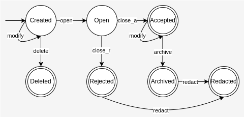

# Diiudicatio Vote

## Vote State Machine

$$
\begin{align*}
\text{States} &=\{\text{Created}, \text{Open}, \text{Accepted}, \text{Rejected}, \text{Archived}, \text{Redacted}, \text{Deleted}\} \\
\text{Initial States} &= \{\text{Created}\} \\
\text{Accepted States} &= \{\text{Accepted}, \text{Rejected}, \text{Archived}, \text{Redacted}, \text{Deleted}\} \\
\text{Alphabet} &= \{modify, open, close_{accept}, close_{reject}, archive, delete, redact\} \\
\text{Transitions} &= \lbrace \\
    & \qquad (\text{Created}, modify, \text{Created}) \\
    & \qquad (\text{Created}, delete, \text{Deleted}) \\
    & \qquad (\text{Created}, open, \text{Open}) \\
    & \qquad (\text{Open}, close_{accept}, \text{Accepted}) \\
    & \qquad (\text{Accepted}, modify, \text{Accepted}) \\
    & \qquad (\text{Accepted}, archive, \text{Archived}) \\
    & \qquad (\text{Archived}, redact, \text{Redacted}) \\
    & \qquad (\text{Open}, close_{reject}, \text{Rejected}) \\
    & \qquad (\text{Rejected}, redact, \text{Redacted}) \\
&\quad \rbrace \\
\end{align*}
$$